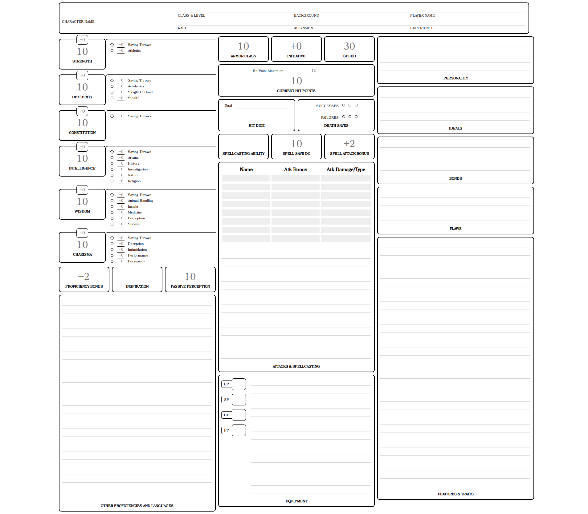

# 5e HTML Character Sheet

Simple 5e character sheet in HTML/CSS/JS

Try it out at: https://tryton-vanmeer.github.io/5e-character-html/

### Development setup

Clone or download this repository

Download the dependencies

    `$ yarn install`

### Building

    `$ yarn build`

Webpage will be in the `build` directory.

To build and watch the src files for changes, and start a live-reload web server.

    `$ yarn start`

### Screenshot

